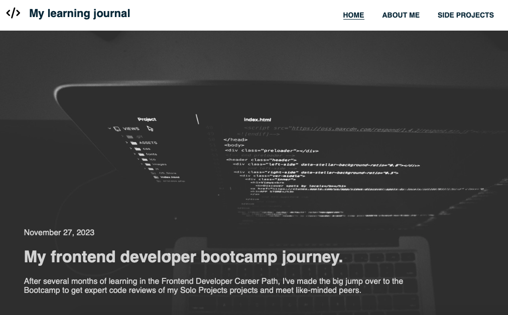

# Learning Journal

## Description
+ This is my learning journal blog which contains my current bootcamp finished main and side projects.

## What is the specs?
- Responsive layout: The site will adapt and respond smoothly to different screen sizes, providing an optimal viewing experience on mobile phones, tablets, and desktops.
- Mobile-first design: The initial design and development will focus on creating a mobile-friendly experience, which will then be enhanced for larger screens.
- Responsive navigation: The site will feature a responsive navigation menu that adjusts its appearance and behavior based on the available screen space.
- Flexible content layout: The content sections will utilize CSS flexbox properties and CSS grid to create flexible and adaptive layouts.
- Media queries: Different CSS styles and layout adjustments will be applied using media queries to target specific screen widths and resolutions.

## Built With

+ HTML
+ CSS
+ JavaScript

## Live Demo

- Live Site URL: [Here]()
